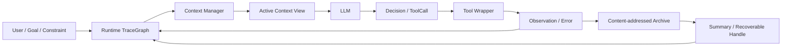

# 架构与数据流

## 分层

1. `schema.py` / `graph.py`：节点、边、生命周期和增量图。
2. `archive.py` / `capture.py`：原始工具结果归档和 wrapper 捕获。
3. `lifecycle.py`：状态推断、硬约束和安全压缩。
4. `context.py`：统一 `ContextManager.select()` 接口及全部对照/消融条件。
5. `runtime.py`：固定 tool-calling scaffold；实验条件只替换 context manager。
6. `adapters/tau.py`：τ-bench/τ³ JSON 到 TraceGraph 的适配。
7. `experiments.py`：离线现象、Oracle、在线前缀回放、baseline/ablation 和结果聚合。
8. `integrations/tau3_agent.py`：在当前 τ³ 环境内运行的半双工 live agent。

## 运行时数据流

每个工具结果先归档，再进入图。context manager 不改变原始日志，只生成当前输入视图。Full Ours 在 token budget 与硬约束冲突时允许超预算，并在结果中设置 `over_budget_due_to_hard_constraints=true`，不会静默删除关键证据。

## 类型不变量

- `produces`: ToolCall/MCPCall → Observation
- `failed_with`: ToolCall/MCPCall → Error
- `uses`: Decision/ToolCall → Observation/Error/Summary/Handle
- `supports`: Observation/Summary/Constraint → Decision
- `blocks`: Error/Constraint → ToolCall/Decision
- `resolves`: Observation/Decision → Error
- `supersedes`: 新 Observation → 旧 Observation
- `compresses`: Summary → Observation/Error/Constraint
- `retries`: 新 ToolCall → 旧 ToolCall
- `leads_to`: Decision → ToolCall/MCPCall

非法类型连接在写入时立即失败，加载后的图还会执行完整结构校验。
