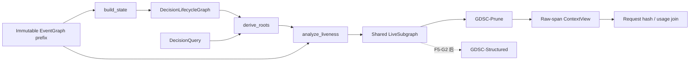
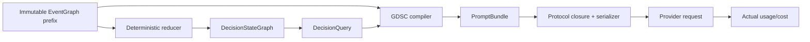
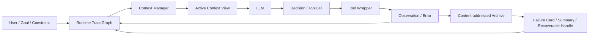
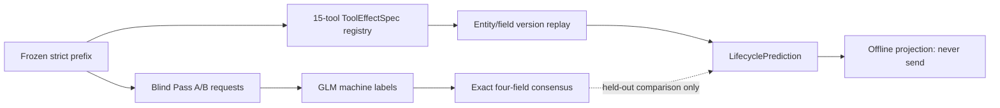

# 项目怎样工作

<!-- 大白话说明 -->
这份文档说明项目怎样工作。下文保留已经采用的接口、规则和历史数字，只把说明改成更容易理解的普通话。本文没有修改程序接口、结果数据或旧文件指纹，也没有新增外部实验。

## 第五阶段 按记录当前用途整理模型输入架构

第五阶段新增 `lifecycle_graph_context`，并保留
`decision_state_compiler/gdsc_core_v1` 作为不可变 第四阶段 兼容身份。新路径把原先耦合在
`compile()` 中的职责拆成四个可独立审计的接口：

```text
build_state(event_graph, cutoff) -> DecisionLifecycleGraph
derive_roots(state, query, tool_schemas, policy) -> LivenessRoots
analyze_liveness(event_graph, state, roots) -> LiveSubgraph
project_context(event_graph, live_subgraph, strategy, provider_protocol)
  -> LifecycleContextView
```



`GDSC-Prune/gdsc_prune_v1` 只回收具有显式 terminal 判断记录现在是否还需要、位于 live closure
之外、协议 span 完整且 单独保存的旧记录 round-trip 已验证的工具 span。保留的原始 message
不改写；system policy 与 native tool schemas 固定计入最终请求。无法判断 判断记录现在是否还需要、
单独保存的旧记录 未验证、parallel span 部分仍 live、pending/missing result、policy/confirmation
或 side-effect receipt 存在时均保守保留。若源历史本身无法形成合法 模型服务商 协议，
视图标记 `send_eligible=false`，而不是删除 hard-live evidence 来修复。

`GDSC-Structured/gdsc_structured_v1` 只冻结身份和 schema，当前整理后交给模型的内容入口会明确拒绝。
F5-E0 的 outcome-blind replay 已因 aggregate 真正拼成完整请求后的-cost criterion 导致 F5-G1
停止，因此本计划下不再进入 F5-G2，也不实现 Structured 整理后交给模型的内容或外部 小规模试跑。

## 第四阶段的记录整理办法 v2.0 当前架构合同

第四阶段的记录整理办法 在旧运行时旁新增编译路径，不修改 `TraceGraph` 的节点枚举，也不追溯改变 `full_ours`。旧 `TraceGraph` 作为不可变 工具使用记录之间的关系 兼容层；新的 `DecisionStateGraph` 只表达某一 cutoff 时刻的目标、实体状态、pending operation、slot、确认、失败 guard、side-effect receipt 和证据依赖。所有事件、atom、edge 与状态使用 canonical JSON 生成稳定 ID/文件指纹，同一 截至当时已有的记录 必须得到同一 state 文件指纹。



核心接口冻结为：

```text
compile(event_graph, decision_state, query, provider_protocol, budget, risk_model)
  -> PromptBundle
```

编译器先满足 hard closure，再以确定性 beam search（默认宽度 16）选择表示。候选表示为 `RAW_MESSAGE`、`STRUCTURED_STATE_DELTA`、`VERIFIED_SUMMARY`、`NEGATIVE_GUARD`、`ARCHIVE_HANDLE` 和 `OMIT`。`VERIFIED_SUMMARY` 只能由 verified atoms 确定性渲染；`NEGATIVE_GUARD` 必须来自 schema、policy predicate、环境状态或验证过的替代路径；`ARCHIVE_HANDLE` 在 R4 前只提供 来源记录，不能替代关键证据。

软实验预算不可行时返回保留 hard state 的 conservative over-budget bundle，并令该 turn 不具 matched-budget 资格；超过 模型服务商 hard context limit 时在发送前中止。每个实际请求必须在发送前持久化完整 artifact，返回后另行回填 模型服务商 actual usage/cost。

## 历史兼容分层

以下分层描述旧 工具使用记录关系图/`full_ours` 路径，继续作为兼容层与历史结果复现依据。

1. `schema.py` / `graph.py`：节点、边、记录现在是否还需要和增量图。
2. `archive.py` / `capture.py`：原始工具结果单独保存的旧记录和 wrapper 捕获。
3. `lifecycle.py` / `failure_cards.py`：状态推断、operation-scope 失败聚合、分类与过期。
4. `context.py`：统一 `ContextManager.select()` 接口、card-aware 主方法及全部对照/去掉一个功能再比较条件。
5. `runtime.py`：固定 tool-calling scaffold；实验条件只替换 记录整理办法。
6. `adapters/tau.py`：τ-bench/τ³ JSON 到 工具使用记录关系图 的适配。
7. `experiments.py`：离线现象、Oracle、在线截至当时已有的记录回放、用来比较的办法/去掉一个功能再比较 和结果聚合。
8. `integrations/tau3_agent.py`：在当前 τ³ 环境内运行的半双工 live agent。

## 运行时数据流



每个工具结果先单独保存的旧记录，再进入图。记录整理办法 不改变原始日志，只生成当前输入视图。`full_ours` 使用 `failure_card_v3`：未解决失败按 operation scope 聚合为受独立子预算约束的 compact card，原始失败和 audit-required 写操作默认留在 单独保存的旧记录，不因“需要可恢复”而自动回注每一轮 prompt。只有当前目标/子目标、有效约束、不可逆动作前的显式确认和不可恢复的唯一关键证据属于 hard set；hard set 自身超过总预算时才显式设置 `budget_infeasible=true`。第二阶段的原始失败硬保留策略保留为 `raw_hard_failure_retention` 对照 记录整理办法。

τ³ live 整理后交给模型的内容将 失败原因和避免办法的简短记录 作为独立 fragment 发送，不使用其 来源记录 节点的历史 message ordinal，因此 card 不会触发 tool-call/result 把工具调用和返回结果成对补齐。运行元数据分别记录 graph-selected representation tokens 与 protocol-closed message tokens；模型服务商 actual input 继续由上游 usage 单独记录。

## 类型不变量

- `produces`: ToolCall/MCPCall → Observation
- `failed_with`: ToolCall/MCPCall → Error
- `uses`: Decision/ToolCall → Observation/Error/Summary/存放编号
- `supports`: Observation/Summary/Constraint → Decision
- `blocks`: Error/Constraint → ToolCall/Decision
- `resolves`: Observation/Decision → Error
- `supersedes`: 新 Observation → 旧 Observation
- `compresses`: Summary → Observation/Error/Constraint
- `retries`: 新 ToolCall → 旧 ToolCall
- `leads_to`: Decision → ToolCall/MCPCall

非法类型连接在写入时立即失败，加载后的图还会执行完整结构校验。

## 第五阶段第一次补充 判断记录是否还需要的证据 overlay

`lifecycle_evidence.py` 在冻结 cutoff 内读取结构化工具名、参数、结果和已有边，生成
`LifecycleEvidenceReport`。它不读取 reward，也不调用模型。Grade A 目前只允许“完整单一
标量结果被后续结构化参数按相同 JSON 类型和值消费”，并在 工具使用记录之间的关系 的内存副本上添加
具有稳定 ID 的 `provides_input` 边；原图和 单独保存的旧记录 不变。成功 side effect 只生成 receipt
保留义务。

Grade B 的实体重合和 mutation-invalidation 记录不进入 overlay。它们只能交给离线 ceiling
整理后交给模型的内容估算最乐观覆盖面；该整理后交给模型的内容带 `unsafe_for_provider_emission` 来源记录，从未被发送给
模型服务商。自由文本正则、模糊匹配和 LLM 分类不能产生 hard-dead。

## 第五阶段第二次补充 双轨记录现在是否还需要建模

第五阶段第二次补充 在 第五阶段第一次补充 上新增两条完全隔离的 development 路径：



`lifecycle_annotation.py` 负责 call-level 完整工具 span、两遍 opaque ID、截至当时已有的记录-only
泄漏防线、结构化响应校验、预算与共识。机器标签不写入 工具使用记录之间的关系，也不能产生 hard-dead。
`lifecycle_state_machine.py` 读取冻结的 `ToolEffectSpec`，顺序维护实体/字段版本和 use-def
关系；完整快照替代、完整标量消费和成功 retry 可以生成终止预测，局部覆盖、未知工具或歧义
统一 拿不准时宁可保留或停止。离线整理后交给模型的内容只有在同一 模型服务商 消息里的所有 call-level span 均安全时才整组
删除，并永久带 `never_send_to_provider=true`。

当前全语料无标签预演的工程完整性率均为 100%；GLM 双遍收集因外部 1305 rate limit
暂停，因此该结果不能被解释为记录现在是否还需要构念准确性或在线效果证据。
