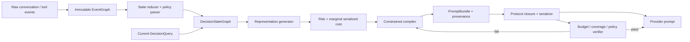

# 第四阶段修改计划（研究重置版）：将工具轨迹编译为最小可验证决策状态

> 计划版本：Phase 4 Research Reset / GDSC v2.1（保留 v2.0 门禁，新增 R2 No-Go 后的 R2.1 修订分支）
>
> 冻结日期：2026-07-21
>
> R2.1 修订日期：2026-07-22
>
> 主方法暂定名：Graph-Constrained Decision-State Compiler（GDSC）
>
> 取代对象：原《第四阶段修改计划：Failure Card 可识别性与投稿级证据链》及 `AGENT_HANDOFF.md` 中“下一步只能执行 Card vs Remove common-prefix fork”的范围约束
>
> 历史成果处理：旧 Phase 4/P3b-A 的 schema、轨迹持久化、离线 evaluator、next-3-action 指标和审计结果全部保留，但降级为 FailureGuard 机制切片与实验基础设施，不再定义论文主线
>
> 外部实验约束：本计划不自动授权外部 API；先完成零 API 的算法、成本核算、benchmark eligibility 和预注册，再单独报告运行规模、模型、预算与停止条件

> 实施记录约束：本文件是设计与冻结协议，不是结果报告。WP0 文档同步、代码实现、离线验证和外部实验的实际状态分别以 Git diff、测试输出及 [`docs/PHASE4_GDSC_RESULTS.md`](docs/PHASE4_GDSC_RESULTS.md) 为准；不得把下文的目标阈值改写为已达到数值。

配套治理文件：[`GDSC_PREREGISTRATION.md`](docs/GDSC_PREREGISTRATION.md) 冻结可执行的 R0–R4 协议，[`CLAIM_EVIDENCE_MATRIX.md`](docs/CLAIM_EVIDENCE_MATRIX.md) 冻结主张边界。改造前工程基线为 `117 passed`、ruff 通过；这是历史比较点，不是 GDSC 新增实现的测试结论。旧 `full_ours` 和 Phase 1–4 产物保持原语义与 hash，不追溯迁移。

> **执行授权更新（2026-07-21）：** 用户随后明确要求实现本计划并继续按门禁实验，因此无需在每个已预注册 stage 重复请求相同授权；该授权不扩展到付费调用、模型 fallback、超过 340 cap、降低阈值、自动补跑或绕过 E0/R2/R3 停止条件。

> **R2 No-Go 后续修订（2026-07-22）：** v2.0 已按门禁执行完成。R0 通过、R1 工程完成；R2 在 261 个冻结 decision points 上的主预算为 8192，hard coverage、structured equivalence 和 provisional sufficiency 通过，但 median serialized reduction 为 `14.956% < 30%`；E0 也不合格。因此 R3/R4 未运行。下文新增 R2.1 成本归因与可达性诊断，不能追溯改变本轮 No-Go，也不授权外部会话。

> **R2.1 执行裁决（2026-07-22）：** 261/261 冻结 baseline 与 261/261 τ³/LiteLLM runtime prompt hash 均通过；真实发送口径的 raw/compiled median 为 `6509/5063`，当前降幅 `15.723%`。即使完全移除动态历史并保留完整 policy 与 native tool schemas，固定成本下界的理论最大 median 降幅也只有 `28.451% < 30%`；airline/retail 分别为 `29.347%/26.583%`。因此进入下文分支 B，冻结不可达性报告，不实现 `gdsc_core_v1.1`，继续停止 R3/R4。完整证据见 [`PHASE4_GDSC_RESULTS.md`](docs/PHASE4_GDSC_RESULTS.md)。

## 0. 决策摘要

第四阶段需要进行的不是一次局部调参，而是一次研究对象重置。

本项目的主目标重新固定为：

> **把不断增长的 agent trajectory 编译成“下一动作所需的最小、可验证、成本可计算的决策状态”，在显著减少实际 provider input token 的同时，使任务成功率和 policy compliance 不劣，最好还能通过减少陈旧信息与冲突信息而提高成功率。**

论文研究的对象不再是 Failure Card，也不只是“哪些历史节点应该保留”。论文研究的对象是一个在线决策状态编译器：它根据当前目标、候选动作、环境状态、policy、证据依赖和生命周期，为每条历史信息选择当前最合适的表示，并在工具协议闭包完成后对最终 prompt 成本负责。

因此，本阶段作出五项明确调整：

1. Failure Card 从主算法降为 `NegativeGuard` 表示，是多种状态表示中的一个机制组件；
2. 从“节点 keep/drop”改成“状态对象 × 表示方式”的联合选择；
3. 从单一 EventGraph 改成“不可变事件图 + 可变决策状态图”双层结构；
4. 从图节点 token 预算改成最终序列化 `PromptBundle` 的 provider-cost-aware 预算；
5. 从自然整段轨迹的弱相关比较改成 common-prefix 表示干预、跨任务风险学习和端到端 Pareto 验证组成的证据链。

旧 Phase 4 已经完成的工程不是失败工作。它证明了 archive 与 active context 必须分离，也暴露出单独优化失败文本并不能形成主论文贡献。它现在应被纳入新方法的一个安全机制切片，而不是继续决定研究范围。

## 1. 对原始研究目标的重新确认

### 1.1 原始调研表达的主问题是正确的

《工具调用建图_生命周期压缩调研报告》已经清楚表达了以下内容：

- 研究对象是工具轨迹中信息价值随任务推进发生的生命周期变化；
- 研究问题是 context reduction 何时因忽略结构依赖而变得不安全；
- 方法方向是 graph-constrained context selection，而不是线性文本删减；
- 每次 LLM 调用前应从图中构造 active context view；
- H4 只是关于失败负证据的一个子假设；
- H5、H6 才对应净 token 收益、任务成功率与 policy violation 的总体研究主张；
- 如果 benchmark 的轨迹长度、生命周期现象或 oracle 压缩空间不足，应调整 benchmark，而不是把论文收缩到一个低频 failure 事件上。

所以，原始调研并没有要求把论文做成 Failure Card 论文。把研究重点改成 Failure Card，是后续执行路线的收缩，不是原始问题陈述的自然结论。

### 1.2 唯一容易诱发误读的句子

原报告 4.4 节的句子“如果 error 没有被 resolved，则不能删除”存在术语歧义。这里的“不能删除”应重新解释为：

> 未解决错误所携带的有效逻辑信息与 provenance 不能被静默丢失；系统必须在 raw、结构化 guard、摘要或可恢复 archive handle 中保留一种足以支持当前决策的表示。

它不等于：

- 原始 error message 必须出现在每轮 prompt；
- unresolved error 必须成为无预算 mandatory item；
- failure 信息比 goal、policy、state、evidence 更值得成为主研究对象；
- 所有失败都应生成固定格式的 Card。

新算法和新论文中不再使用含糊的“删除/保留”二元表述，而统一使用：

- logical preservation：逻辑信息是否仍存在；
- storage preservation：原始记录是否可恢复；
- prompt exposure：本轮模型实际看到什么；
- representation level：模型看到 raw、state delta、summary、guard、handle 还是不暴露；
- provider cost：协议闭包后实际发送多少 token。

## 2. 对前几阶段误读与研究漂移的反思

### 2.1 把一个局部反例修复成了主方法

第二阶段正确发现“未解决失败原文无预算硬保留”会导致 token 膨胀，且没有改善成功率。合理的局部修复是把 raw failure 改成 scoped、bounded、expirable 的 compact representation。

后续错误在于：我们没有在完成这个修复后回到总体问题，而是把这个局部修复继续扩展成 Failure Card schema、Failure Card gold、Card vs Remove、Card-visible fork 和 Card 因果主张。H4 从六个假设之一变成了整个实验路线的中心。

### 2.2 把“图中保留”再次近似成了“prompt 中出现”

第三阶段已经区分 archive、逻辑保留和模型可见，但选择器仍主要返回历史节点或其 Card 表示。它还没有真正生成一个面向下一动作的独立状态。

结果是：

- EventGraph 同时承担审计 IR、状态表示和 prompt 选择三个职责；
- selector 的基本单位仍是历史节点，而不是当前决策所需的 state atom；
- 大量 `recent_optional` 由 recency 贪心选择，而不是由下一动作的前置条件选择；
- policy、goal、entity state、evidence、pending operation 和 negative evidence 没有进入统一的决策状态模型。

### 2.3 优化了错误的成本函数

当前选择器在图节点估算 token 上执行预算，但 provider 实际接收的是经过消息投影和 tool-call/result 协议闭包后的 prompt。一个被选中的历史节点可能恢复整条 assistant/tool 消息，也可能因压缩片段而不恢复原文，因此图内 token 不是实际优化目标。

Phase 3 `full_ours` 的 192 个 context views 显示：

| 指标 | 观测值 |
| --- | ---: |
| 平均 graph-selected representation tokens | 3,032.9 |
| 平均 protocol-closed message tokens | 5,827.5 |
| 两个均值之比 | 1.92× |
| 单 view 协议/图 token 比值均值 | 1.73× |
| 单 view 最大比值 | 3.52× |

这意味着“4096 图内预算”并不等于“4096 provider prompt 预算”。如果论文主张 token reduction，优化器必须直接面对最终序列化成本。

### 2.4 用低频 failure 事件替代了通用生命周期现象

旧 Phase 4 的 60-session 回放只有 49 个 eligible failure events、45 个有后续 action 的事件，其中 23 个被会话终止截尾。Compact Card 条件只有 7 个事件，目标 Card 只在 12 个后续 action 中实际可见。

同时，`full_ours` 的 192 个 view 中：

| 选择原因 | 总 token | 平均每 view token |
| --- | ---: | ---: |
| `active_constraint` | 321,600 | 1,675.0 |
| `recent_optional` | 203,772 | 1,061.3 |
| `recoverable_critical_evidence` | 29,381 | 153.0 |
| `current_goal` | 16,690 | 86.9 |
| `current_subgoal` | 5,366 | 27.9 |
| `failure_card:actionable` | 5,355 | 27.9 |

Failure Card 只占很小一部分输入。继续围绕它做主实验，即使取得局部正结果，也很难解释总 token 的主要来源，更难支持通用 graph-constrained context management 主张。

### 2.5 Card 本身没有编译出动作级信息

当前 27 次 Card exposure 的 `next_admissible_correction` 全部是同一句泛化模板：

```text
change the failed arguments or use an admissible alternative path
```

这不是“下一动作所需的状态”，而是对失败的泛化描述。它缺少具体 violated predicate、缺失参数、可行动替代、适用 policy、当前实体状态和可验证来源。旧 v2 provisional 的 retention precision 只有 0.176，也说明系统主要风险是过度保留，而不是危险遗忘。

### 2.6 实验先于 estimand 收敛

旧矩阵比较的是不同完整轨迹，failure 发生、终止步数、agent action 数和 evaluator 可用性都随条件变化。整段 session token 与 repeated-invalid 因而被前缀差异和轨迹随机性混杂。

common-prefix fork 的思路是正确的，但只做 Card vs Remove 仍然把 estimand 限制在 H4。新计划保留 common-prefix 设计，干预对象改为跨节点类型的表示选择：Raw、Compiled、Drop。

## 3. 文档权威性与“不能继续参考”的范围

这里的“不能参考”指不能把旧文档中的范围判断、下一步命令或论文主张继续当作规范性指令；不代表删除历史数据或否认其中已验证的工程事实。

| 文档 | 仍然有效、可以引用 | 已失效、不能作为新阶段依据 |
| --- | --- | --- |
| `工具调用建图_生命周期压缩调研报告.md` | Motivation、Scientific Question、graph-constrained selection、生命周期、archive/active 分离、H1/H2/H5/H6、benchmark 不合适时应调整 | 4.4 节“未 resolved error 不能删除”若被解释为原文每轮可见；任何把 H4 当主假设的扩张解释 |
| `第二阶段修改计划.md` | factorized lifecycle、canonical temporal edges、semantic outcome、token/provenance 基础设施 | 大规模 baseline/benchmark 矩阵的具体顺序与旧 `full_ours` 设计，不再作为新主算法规范 |
| `第二阶段实验结论.md` | hard raw failure retention 无效、archive 与 prompt exposure 必须分离、scope/expiry/actionability 诊断 | “下一轮应以 compact negative-evidence policy 为中心”只能视为局部修复建议，不能继续定义论文主目标 |
| `第三阶段修改计划.md` | 对现有代码行为的诊断、消息协议闭包问题、provider token accounting、Failure Card 已实现事实及 P3 结果 | 5.5–5.7 节收缩通用图语义、延后强 baseline、只做 failure edges 的建议；第 6 节把研究问题限定为 Failure Card；Card/Remove/Raw 四条件主矩阵；把 negative-results Card 论文视为默认收口 |
| 原 `第四阶段修改计划.md` v1 | v2 annotation、generation/evaluator 解耦、固定窗口指标、fail-closed gate 的工程要求 | 整体不再是未来行动计划；Card-visible 10-prefix/40-branch pilot 不再是唯一下一步；“无法识别 H4 就停止总体研究”的判断失效 |
| `docs/PHASE3_RESULTS.md` | 冻结实验数值、provenance、CI、No-Go 结论 | 不能用 P3 的 Card 点估计支持通用图方法，也不能用低频 failure 否定总体决策状态编译目标 |
| `docs/PHASE4_RESULTS.md` | 117 tests 基线、v2 provisional、trajectory/evaluator 解耦、49-event 回放、Card exposure 与工程 gate | 第 7 节把 P3b-B Card fork 或 measurement/negative-results 当作唯一后续路线的建议不再有效 |
| `AGENT_HANDOFF.md`（2026-07-20 快照） | 代码位置、冻结产物、实验 provenance、已知 bug、禁止伪装人工 gold 和禁止绕过 API gate | 第 0 节“下一步只能准备 Card-visible prefix”、第 5.2–5.3 节 Card-only fork、明确禁止增加一般表示/benchmark/baseline、最后一句交接结论，全部被本计划取代 |

执行优先级从高到低为：

1. 本文件 v2.0；
2. 后续新增的 GDSC preregistration 与正式实验 manifest；
3. `docs/PHASE4_RESULTS.md` 及旧阶段文件中的客观结果；
4. 旧阶段文件中的范围建议与下一步命令，仅作研究过程记录。

任何未来 agent 如果发现文档冲突，必须按这个优先级执行，不能再用旧 handoff 把工作锁回 Failure Card。

## 4. 新的研究问题与假设

### RQ0：这个 benchmark 是否真的包含可压缩的决策状态？

在运行大矩阵前，先判断轨迹是否足够长、是否存在 state update、supersession、constraint scope、evidence reuse 和可恢复 observation，以及在保留决策充分性后是否仍有显著 oracle headroom。

### RQ1：图结构和生命周期能否预测一次表示降级的决策伤害？

研究单位从 session 改为：

```text
decision point × state/event object × candidate representation
```

目标是预测某对象从 Raw 降为 Structured/Summary/Guard/Handle/Drop 后，下一动作无效、无进展、违反 policy 或最终成功受损的风险。

### RQ2：多表示决策状态能否在相同 prefix 下保持下一动作质量？

在完全相同的 conversation prefix 和 environment snapshot 上，直接干预单个信息对象的表示，比较 Raw、Compiled 和 Drop。该实验识别“什么可以被编译成更短状态”，而不是只识别“失败文本是否应保留”。

### RQ3：graph constraints 在相同实际 token budget 下是否降低 unsafe omission？

把 GDSC 与只基于 recency、LLM relevance 或通用压缩器的选择放在相同最终 provider input 预算下，比较关键前置条件、唯一证据、适用 policy 和未完成状态的遗漏率。

### RQ4：GDSC 是否实现端到端 token–reliability Pareto 改善？

主效应是实际 provider input/action 和总 provider input 的减少；可靠性约束是 task success 与 policy compliance 非劣，且 action count、重复查询和副作用错误不增加。

### RQ5：哪些机制贡献了收益？

分析表示层级、生命周期、图闭包、protocol-aware cost、policy checker、FailureGuard 和 archive recovery 的独立贡献。FailureGuard 只属于 RQ5，不再单独承担中心主张。

对应假设调整为：

- H1：event/state 的生命周期、图距离、唯一证据性、scope 与前置条件状态能够预测表示降级伤害；
- H2：与 keep/drop 相比，多表示编译在相同下一动作质量下需要更少 provider token；
- H3：与无图 cost-only 选择相比，图约束在相同 token budget 下产生更少 unsafe omission 和 policy violation；
- H4：GDSC 相比 Full Trajectory 和最强通用压缩 baseline 显著减少 provider input/action，同时 task success 非劣；
- H5：收益在至少两个具有不同轨迹结构的 benchmark 或 domain 上成立，且扣除编译开销后仍为正；
- H6：NegativeGuard 对 failure-relevant decision points 有局部收益，但它不是 H4 成立的必要条件。

## 5. 主算法：Graph-Constrained Decision-State Compiler



### 5.1 算法输入与输出

第 (t) 次模型调用前，编译器接收：

- 不可变历史事件图 (G_t^E)；
- 当前决策状态图 (G_t^D)；
- 当前决策查询 (q_t)，包括 active goal、open subgoal、候选工具/动作族、待填参数和 side-effect level；
- provider 消息协议与 tokenizer/cost model；
- 最终 prompt 预算 (B_t)；
- 表示降级风险模型 \(\hat R\)。

输出不是节点列表，而是一个可直接发送的 `PromptBundle`：

```text
PromptBundle:
  system_rules
  active_goal
  open_subgoals
  current_entities_and_slots
  pending_operations
  applicable_constraints
  verified_evidence
  recent_state_deltas
  negative_guards
  archive_handles
  protocol_messages
  provenance_manifest
  serialized_token_cost
```

### 5.2 双层图结构

#### A. EventGraph：不可变审计与 provenance 层

保留当前 TraceGraph 的优势：

- user/assistant/tool call/tool result/error/decision 的完整事件；
- produces、failed_with、supports、blocks、retried_by、resolved_by、superseded_by、summarized_by 等 canonical edges；
- raw archive reference、hash、source message ordinal、时间顺序；
- evaluator、usage 和 environment snapshot provenance。

EventGraph 不再直接等于 prompt memory。它回答“发生过什么、从哪里来、如何恢复”。

#### B. DecisionStateGraph：面向下一动作的可变状态层

新增以下 state atoms：

- `ActiveGoal` / `OpenSubgoal`；
- `Entity` / `SlotValue` / `UnknownSlot`；
- `KnownFact` / `ConflictingFact` / `SupersededFact`；
- `PendingOperation` / `CompletedOperation`；
- `Precondition` / `ConfirmationRequirement`；
- `ApplicablePolicyRule` / `GlobalPolicyRule`；
- `CriticalEvidence` / `EvidenceSet`；
- `StateDelta`；
- `NegativeGuard`；
- `CandidateAlternative`；
- `ArchiveHandle`。

核心边包括：

- `required_for(action)`；
- `fills(slot)`；
- `supports(claim/action)`；
- `blocks(action)`；
- `satisfies(precondition)`；
- `violates(rule)`；
- `supersedes(state)`；
- `conflicts_with(state)`；
- `derived_from(event)`；
- `resolves(operation/guard)`；
- `alternative_for(operation)`。

DecisionStateGraph 回答“此刻要做什么、还缺什么、依据是什么、什么不能做”。每个 atom 必须有 EventGraph provenance；没有来源或验证器的自由摘要不能成为 hard fact。

### 5.3 表示格，而不是 keep/drop

对每个仍可能相关的对象 (v)，编译器生成可行表示集合：

```text
RAW_MESSAGE
STRUCTURED_STATE_DELTA
VERIFIED_SUMMARY
NEGATIVE_GUARD
ARCHIVE_HANDLE
OMIT
```

这些表示按信息量大致递减，但不是所有对象都允许所有表示：

- side-effect receipt 可用 Structured Delta，但必须保留 raw archive；
- 唯一且不可恢复的 evidence 不允许 Handle 或 Omit；
- superseded observation 通常可降为 Handle 或 Omit；
- policy-denied failure 可转为 action-conditioned NegativeGuard；
- unresolved slot 不应保留整段历史，只需保留 slot 状态、来源和缺失原因；
- 近轮原始 tool exchange 只有在 provider 协议要求时才保留 Raw。

### 5.4 决策查询与 action-conditioned relevance

`DecisionQuery` 至少包含：

```text
goal_id
subgoal_id
candidate_action_family
candidate_tools
required_slots
known_entities
pending_confirmation
side_effect_level
applicable_policy_scope
expected_environment_transition
```

相关性不再由“离当前有多近”单独决定，而由对象是否连接到当前 query 决定。只有无法形成候选动作时才保守扩展到最近状态；recency 是 tie-breaker，不是主选择器。

### 5.5 Provider-cost-aware 优化目标

主优化问题定义为：

\[
P_t^* = \arg\min_{P \in \mathcal{P}(G_t^D,q_t)}
\operatorname{TokenCost}(\operatorname{Serialize}(\operatorname{Closure}(P)))
+ \lambda \widehat{R}_{omit}(P \mid G_t^D,q_t)
+ \mu \operatorname{CompileCost}(P)
\]

满足：

1. active goal 与 open subgoal coverage；
2. 候选动作 required slots coverage；
3. applicable global/hard policy coverage；
4. 唯一 critical evidence 的 provenance closure；
5. pending confirmation 与 side-effect receipt coverage；
6. provider tool-call/result protocol validity；
7. 最终序列化 prompt 不超过 (B_t)；
8. 所有压缩表示可追溯到 raw source；
9. 风险或验证不确定时 fail closed 到更丰富表示。

`TokenCost` 必须由最终消息序列计算，不能再把单个 graph item token 简单相加。由于 tool-call/result closure 具有非加性，候选表示的边际成本定义为重新序列化后的差：

\[
\Delta c(v,r \mid P)=c(P\cup\{(v,r)\})-c(P)
\]

第一版实现不追求不可解释的全局神经优化。使用可审计的 constrained beam search：

1. 加入所有 hard coverage closure；
2. 为每个对象生成合法表示；
3. 计算 risk reduction / marginal serialized cost；
4. 保留 8–16 个候选 bundle 的 beam；
5. 每次扩展后执行 protocol、coverage、provenance 和 budget verifier；
6. 输出最小成本且风险低于阈值的 bundle；
7. 若没有可行解，记录 `budget_infeasible` 并回退到保守 bundle，不静默截断。

### 5.6 Omission-risk 模型

风险模型分两层：

#### 确定性安全掩码

以下对象默认禁止直接 Omit：

- 当前 goal/subgoal；
- 候选动作未满足的 required slot；
- 不可逆动作的 confirmation；
- 唯一且不可恢复的 critical evidence；
- 当前 applicable global policy；
- 当前环境仍未解决的 blocking state；
- protocol closure 所需消息。

#### 可校准统计模型

特征包括：

- node/state type；
- 到 current goal、candidate action、final evidence 的有向距离；
- in/out edge types 和唯一证据性；
- active/resolved/superseded/conflicting validity；
- operation/entity/policy scope overlap；
- required-slot 与 precondition coverage；
- side-effect level；
- age 与后续 state delta 数；
- raw/compiled/closure 后 token cost；
- protocol expansion factor；
- archive recoverability；
- representation type。

初版使用可解释、可校准模型，例如带单调约束的 gradient boosting 或正则化 logistic model，并报告 Brier score、ECE、AUROC/AUPRC 和分层校准。训练/验证/测试必须按 task 或 repository 切分，禁止同一任务的相邻 decision points 跨 split 泄漏。

### 5.7 Policy rule compiler

当前 `active_constraint` 平均占 1,675 token/view，是最大的固定输入来源。不能只压缩 observation 而忽略 policy。

但直接摘要 system policy 风险过高，因此分两档：

- `GDSC-Core`：保留完整 system policy，只编译动态轨迹；这是安全主版本；
- `GDSC-Policy`：把 policy 解析为带 scope、trigger、precondition、exception 和 dependency 的规则图，仅暴露全局规则与当前 action-relevant rules，并在工具调用前用确定性 checker 再验证；不确定或解析失败时恢复完整相关 policy section。

正式主张必须先由 `GDSC-Core` 成立。`GDSC-Policy` 作为高收益扩展，单独报告 policy coverage 和 violation，不允许用更短 system prompt 掩盖动态状态编译无效。

### 5.8 Failure Card 改造成 action-conditioned NegativeGuard

旧 Card 改为：

```text
NegativeGuard:
  action_family
  entity_scope
  violated_predicate
  observed_failure
  failed_argument_delta
  admissible_alternatives
  required_new_evidence
  expiry_condition
  source_event_ids
  verifier
```

规则：

- 只有 guard scope 与当前 candidate action 重叠时才进入 prompt；
- `next_admissible_correction` 必须由 tool schema、policy predicate、environment state 或成功替代路径导出；
- 禁止继续生成“change arguments or use alternative path”这类无验证器的通用建议；
- guard 失效后转为 ArchiveHandle，不继续占动态 prompt；
- raw failure 仍保存在 EventGraph/archive；
- FailureGuard 的效果只在 failure-relevant prefix 中作为机制分析，不决定总体方法是否成立。

## 6. 代码修改工作包

### WP0：研究治理与兼容边界

- 更新 `AGENT_HANDOFF.md`，将旧 Card-only 下一步标为 historical；
- 冻结旧 P1–P4 结果和 hash，不原地改写实验产物；
- 旧 managers 保留为 baselines，`full_ours` 的历史语义不追溯修改；
- 新方法使用新名称 `decision_state_compiler` 和独立 `context_policy_version`；
- 所有新实验 manifest 记录 plan version、git commit、provider、tokenizer、serializer、risk model 和 representation schema。

### WP1：最终 prompt 成本与 `PromptBundle`

新增：

- `src/tracegraph/prompt_bundle.py`；
- `src/tracegraph/provider_cost.py`；
- `scripts/profile_prompt_costs.py`。

修改：

- `message_protocol.py`：从“返回 ordinals/fragments”升级为返回带 closure provenance 的 bundle；
- `integrations/tau3_agent.py`：发送前记录最终 serialized message、估算 token、provider actual input、closure expansion 和 fragment source；
- `context.py`：legacy selector 继续可用，但新编译器不再以 `ContextItem.selected_tokens` 作为预算真值。

验收：

- 每次调用都能解释 graph-selected、compiled、protocol-closed、serialized 和 provider-actual 五层成本；
- 预算施加在 serialized prompt；
- tokenizer 可用时 token 误差中位数不超过 5%、P95 不超过 10%；
- protocol closure 的每个新增消息都有触发来源；
- property tests 覆盖并行 tool calls、缺失 result、fragment-only representation 和多消息闭包。

### WP2：DecisionStateGraph 与 deterministic state reducer

新增：

- `src/tracegraph/decision_state.py`；
- `src/tracegraph/state_reducer.py`；
- `src/tracegraph/decision_query.py`；
- `src/tracegraph/policy_rules.py`。

先在 τ³ retail/airline adapter 上用 tool schema、policy 和环境对象构建确定性 state delta；LLM semantic parser 只作为低置信 fallback，且输出必须经过 schema 与 provenance 校验。

验收：

- 相同 EventGraph 产生确定性相同 state hash；
- 每个 state atom 至少有一个 source event；
- superseded/conflicting state 不会同时作为当前真值；
- pending operation、required slots、confirmation 和 completed operation 可由合成测试覆盖；
- state reducer 不读取未来事件。

### WP3：表示生成与验证

新增：

- `src/tracegraph/representations.py`；
- `src/tracegraph/representation_verifiers.py`；
- `src/tracegraph/negative_guards.py`。

每种表示保存 `source_ids`、`covered_atoms`、`lost_fields`、`verifier`、`raw_ref`、`estimated_cost` 和 `serialized_marginal_cost`。

验收：

- structured delta 与 raw state 在关键字段上等价；
- verified summary 的 claim 必须被 source evidence 覆盖；
- NegativeGuard 不允许通用 correction fallback；
- Omit 决策必须记录原因和风险；
- archive round-trip 能恢复 raw source 并验证 hash。

### WP4：GDSC optimizer 与 fail-closed compiler

新增：

- `src/tracegraph/compiler.py`；
- `src/tracegraph/omission_risk.py`；
- `src/tracegraph/compiler_checks.py`；
- `src/tracegraph/integrations/gdsc_manager.py`。

验收：

- hard coverage、provenance、protocol 和 final budget 四类 invariant 全部机器验证；
- budget infeasible 不静默丢 hard state；
- beam search 有确定性 seed 和完整 decision log；
- 可复现 `no_graph`、`no_lifecycle`、`keep_drop_only`、`node_cost_only`、`no_policy_checker`、`no_negative_guard` 消融；
- legacy managers 与旧测试全部继续通过。

### WP5：决策点数据集与 common-prefix 干预框架

新增：

- `src/tracegraph/decision_point_dataset.py`；
- `src/tracegraph/prefix_forks.py`；
- `scripts/build_decision_point_dataset.py`；
- `scripts/run_representation_forks.py`；
- `scripts/score_representation_harm.py`；
- `scripts/fit_omission_risk.py`。

必须复用旧 Phase 4 的 generation/evaluator 解耦、immutable artifacts 和 hash 校验。fork 前 conversation、environment、decision-state 和 model config 全部匹配；fork 后只允许目标 representation 不同。

### WP6：实验分析与论文产物

新增：

- `scripts/evaluate_benchmark_eligibility.py`；
- `scripts/analyze_gdsc_matrix.py`；
- `scripts/build_pareto_report.py`；
- `docs/GDSC_PREREGISTRATION.md`；
- `docs/PHASE4_GDSC_RESULTS.md`；
- `docs/CLAIM_EVIDENCE_MATRIX.md`。

所有图表从冻结 JSON/CSV 自动生成；论文表格不得手工复制未带 provenance 的数值。

## 7. 实验重新设计

### E0：Benchmark eligibility 与 oracle headroom

在任何正式在线矩阵前，对候选 benchmark 的 full-context trajectories 计算：

- median / P75 agent actions；
- dynamic provider input 占比；
- observation 长度与重复率；
- state update、supersession、conflict、open-slot、policy-scope 和 side-effect 事件率；
- evidence 被后续动作复用的距离；
- raw-to-verified-state oracle 压缩率；
- fork snapshot 可复现性；
- native success/policy/collateral-damage evaluator 可用性。

进入主实验的最低条件：

- median agent actions ≥ 10；
- 动态历史而非固定 system prompt 至少占 provider input 的 40%；
- 至少 30% oracle provider-token headroom；
- 至少三类非 recency 生命周期现象各有 30 个以上可审计 decision points；
- 可冻结并恢复 common prefix 环境；
- full-context success 原则上位于 20%–85%，不处于严重 floor/ceiling；
- 自动 evaluator 能区分任务成功与不允许的副作用。

若当前 τ³ 子集不满足，不得再把低事件率解释成 Failure Card 需要更多样本；应更换 task subset、domain 或 benchmark。

### E1：决策状态构念验证

抽样单位：

```text
decision point × candidate object × representation
```

对象至少分六层：

1. goal/subgoal；
2. policy/constraint/confirmation；
3. entity/state/slot；
4. evidence/large observation；
5. superseded/conflicting/expired state；
6. failure/negative guard。

标注与机器验证回答：

- 当前动作需要哪些 state atoms；
- 哪些 raw 字段可以丢失；
- compiled representation 是否 decision-sufficient；
- provenance 是否足以验证；
- Drop 是否会切断 required/evidence path；
- 表示的最终 serialized marginal cost。

正式 gold 至少使用两位独立标注者和第三方裁决。近单类别字段同时报告分布、原始一致率、κ 与 AC1，不再用单一 κ 决定质量。

### E2：Common-prefix representation intervention

第一轮 pilot：

```text
30 decision prefixes
× 3 representations (Raw, Compiled, Drop)
× 2 replicates
= 180 short branches
```

30 个 prefix 按上述六类对象分层，每类至少 5 个；Failure 只占六分之一左右，而不是全部。

每个 prefix 冻结：

- task/domain/seed；
- conversation 与 environment snapshot；
- EventGraph 与 DecisionStateGraph hash；
- current DecisionQuery；
- target object 与三种 representation payload；
- source ids、coverage、serialized prompt hash；
- model/provider/temperature/tool schema；
- 1–2 个决策或最多 3 个 agent tool actions 的 horizon。

Primary local outcomes：

- next action 是否 schema-valid；
- 是否满足当前 required slots/preconditions；
- 是否产生 policy violation 或不允许副作用；
- 是否取得环境可验证 progress；
- 相对 Raw 是否发生 representation-induced harm。

Secondary：

- local provider input/output；
- repeated query/action；
- recovery action index；
- 模型是否请求 archive recovery；
- Compiled 与 Drop 的 discordant pair rate。

pilot 只估计事件率、干预有效性和功效参数。正式样本量根据 paired discordance 和目标非劣 margin 计算，不因为点估计有利而直接扩矩阵。

### E3：Omission-risk 学习与离线反事实评估

使用 E1/E2 构建标签：

```text
harm = invalid_action
    OR violated_precondition
    OR policy_violation
    OR no_progress_when_raw_progresses
    OR task_failure_when_raw_succeeds
```

比较：

- recency-only；
- token-cost-only；
- LLM relevance score；
- lifecycle features only；
- graph features only；
- graph + lifecycle + cost（完整风险模型）。

报告 task-held-out 和 benchmark-held-out 结果。主指标是高风险 omission 的 recall、低风险样本的可压缩率和 calibration，而不是只报 AUROC。

### E4：同预算的机制比较

在冻结 full trajectories 或可重放环境上，对所有方法施加相同最终 serialized provider budget，比较：

- unsafe omission；
- decision-state coverage；
- evidence-path preservation；
- policy-rule coverage；
- protocol expansion；
- estimated 与 actual provider cost 偏差。

该实验回答图约束是否真正优于只压缩文本。它必须在运行昂贵端到端 session 前通过。

### E5：端到端 Pareto 主实验

主矩阵保留四个有清晰角色的条件：

1. `Full Trajectory`：可靠性参考；
2. `Strong Compressor`：官方 ACON 或 eligibility 后表现最强的忠实通用压缩器；
3. `GDSC-Core`：完整 policy + 动态决策状态编译；
4. `Strong Compressor + GDSC Safety/State Layer`：检验方法是替代还是可组合可靠性层。

`Last-k` 和 `Summary-only` 只作为低成本 sanity baselines，不进入所有正式模型矩阵。旧 `Raw Hard`、`Remove`、`Compact Card` 只在 failure slice 中复现，不进入论文主表。

实验采用 task × seed 配对；模型、temperature、tool schema、user simulator、evaluator 和 max steps 固定。正式规模由 pilot 方差与 paired non-inferiority power 决定，最低应保证每个 primary benchmark 有足够 task-level pairs 使 success risk-difference 95% CI 能检验 -0.05 margin，而不是预先固定一个看似很大的 session 数。

资源规划采用三级规模，不跨 gate 自动执行：

- development：每个 benchmark 20 个 tasks × 4 conditions × 2 seeds = 160 sessions；
- confirmatory 规划值：每个 benchmark 80–100 个 distinct tasks × 4 conditions × 3 seeds = 960–1,200 sessions，最终数值由 pilot power analysis 冻结；
- model-family robustness：中心 gate 通过后，在分层抽取的 30–50 个 tasks 上用第二模型家族复跑 4 conditions × 2 seeds；该结果用于限定外部有效性，不与 primary model 混池。

每一级执行前都必须单独生成成本估算、最大 session 数、并发/限流、停止条件和 external API authorization。development 失败时不进入 confirmatory。

### E6：消融与错误分析

消融：

- `no_graph_edges`；
- `no_lifecycle`；
- `keep_drop_only`；
- `node_estimated_cost` 替代 serialized cost；
- `recency_ranking` 替代 action-conditioned relevance；
- `no_policy_checker`；
- `no_negative_guard`；
- `no_archive_recovery`。

错误分析按以下切片报告：

- long observation vs short state；
- side-effect vs read-only；
- policy-heavy vs state-heavy；
- supersession/conflict；
- missing slot/precondition；
- failure recovery；
- early/middle/late trajectory；
- compression ratio decile；
- benchmark/domain/model family。

## 8. Benchmark 选择与角色

### 8.1 当前 τ³ / τ-bench-family harness：开发与 policy/state 主场景

保留原因：

- 已有稳定 adapter、typed tools、policy、用户对话、数据库状态与 provider usage；
- 可验证 confirmation、side effect、state transition 和 policy compliance；
- 旧实验与 provenance 可直接用于 regression 和成本诊断。

限制：

- 当前 retail failure-rich 子集的真实 retry/resolve 仍稀少；
- 部分轨迹偏短；
- user simulator 与 evaluator 会增加随机性和成本；
- 不应再用 failure-rich 作为唯一 task selection 标准。

新 task sampling 应按长轨迹、跨子目标、policy scope、state update、supersession 和 observation headroom 分层，而不是只按 Error/retry 排名。该 benchmark 适合验证 GDSC 的 constraint、pending operation、entity state 与 evidence closure，不只验证 NegativeGuard。

### 8.2 AppWorld：建议作为第二个 primary benchmark

[AppWorld 官方项目](https://appworld.dev/)提供多 app、数百 API、交互式代码/API 调用和基于最终数据库状态的评测，还能检查 collateral damage。这与 DecisionStateGraph 的 entity state、跨 app dependency、state delta 和 side-effect verification 高度匹配。

进入条件：

- 先用 20–30 个任务做 full-context eligibility；
- adapter 能把 API call/result 与 state changes 映射到 EventGraph；
- environment snapshot 可复现 common-prefix fork；
- 不因 coding shell 的大段源码固定输入掩盖 trajectory reduction。

如果通过，AppWorld 与 τ³ 形成互补：前者强调跨 app 状态与 collateral damage，后者强调对话、policy 和 confirmation。

### 8.3 SWE-bench Verified + mini-SWE-agent：外部有效性扩展，不作为最早主实验

[SWE-bench 官方仓库](https://github.com/SWE-bench/SWE-bench)提供真实软件问题和容器化测试，[mini-SWE-agent](https://mini-swe-agent.com/)提供轻量 scaffold 与可审计 trajectory。coding agent 的搜索结果、测试日志、patch、重新测试与 supersession 很适合验证长 observation 和 evidence lifecycle。

但其容器、磁盘、运行时间和模型成本更高，policy/用户确认结构也弱。因此只在 GDSC-Core 已在前两个场景通过后，选择一个预注册子集做第三场景外部有效性，而不是用它替代主机制识别。

### 8.4 Benchmark 选择结论

推荐顺序：

1. 用现有 τ³ 数据完成零成本 cost/state eligibility 与 compiler 开发；
2. 运行小规模 τ³ common-prefix representation pilot；
3. 对 AppWorld 做 20–30 task eligibility，满足 gate 后成为第二 primary benchmark；
4. 只有主方法成立后，才接入 SWE-bench/mini-SWE-agent 子集。

任何 benchmark 若 oracle headroom < 30%、median actions < 10 或无法可靠 fork，都不进入主实验。调整 benchmark 是原始调研允许的正确路线，不是研究失败。

## 9. Baselines 与相关算法的使用方式

相关工作不再只作为引用，而用于明确对照角色：

- [ACON](https://github.com/microsoft/acon)：当前最重要的强 trajectory compressor 对照；使用官方实现、固定源码 hash 和真实 provider cost；
- [AgentDiet](https://arxiv.org/html/2509.23586)：作为 trajectory reduction 与 cost-quality trade-off 的相关工作，不在没有忠实适配前伪装成 baseline；
- [MEM1](https://github.com/MIT-MI/MEM1)：其增量 memory-state 思路用于对比“维护状态”与“压缩历史”，但 GDSC 的差异是显式图约束、provenance、多表示和 provider-cost-aware 编译；
- [AgentRx](https://github.com/microsoft/AgentRx)：用于失败轨迹结构分析和诊断相关工作，不等于在线 context compiler；
- [ExpeL](https://github.com/LeapLabTHU/ExpeL)：用于跨轨迹经验抽取相关工作；本项目主研究的是单条运行时轨迹的下一决策状态，不把离线经验学习混入 primary estimand。

Baseline 公平性要求：

- 同模型、同 agent scaffold、同工具、同 task/seed；
- 相同最终 serialized token budget，而不是相同 selector 内部预算；
- compressor 自身的 LLM token、延迟和美元成本计入净成本；
- fallback 次数与 Full fallback token 单列；
- 不允许把 proxy summary 命名为官方算法；
- 官方代码不可用或不兼容时，宁可不列为正式 baseline，也不做不忠实复刻。

## 10. 指标、统计与 AAAI 级证据标准

### 10.1 Primary outcomes

- task success / native state-based reward；
- actual provider input tokens per agent action；
- total actual provider input tokens per session；
- policy violation / collateral damage；
- net token cost：agent input + compiler/compressor model input/output；
- action count 与 normal stop。

其中 provider input/action 是效率主指标，总 input 是系统成本主指标。二者必须同时报告，防止通过增加动作数获得每步 token 降低，或通过提前失败获得总 token 降低。

### 10.2 Mechanism outcomes

- decision-state coverage；
- required-slot / precondition coverage；
- evidence-path preservation；
- applicable-policy coverage；
- unsafe omission；
- stale/conflicting state exposure；
- archive recovery rate 与成功率；
- representation distribution；
- protocol expansion factor；
- risk calibration；
- compile latency、fallback 和 budget infeasibility。

### 10.3 预注册主比较

主比较只冻结两个：

1. GDSC-Core vs Full：token reduction + success/policy non-inferiority；
2. GDSC-Core vs strongest compressor：matched-cost reliability 或 matched-reliability token reduction。

组合方法、policy compiler 和所有消融为 secondary。FailureGuard 为 mechanism slice，不进入主比较。

### 10.4 统计规范

- task × seed 配对，不把单步 view 当独立样本估计端到端显著性；
- common-prefix 实验使用 prefix 内配对和 discordant counts；
- paired bootstrap 按 task 分层，报告分子、分母、effect size 和 95% CI；
- binary success/policy 报 paired risk difference 与 exact McNemar；
- 非劣效 margin 在看正式结果前冻结，默认 success 为 -0.05；
- token 同时报告绝对差、相对差、CI 和 heavy-tail 分布；
- 多个 secondary comparison 使用 Holm correction；
- benchmark/model 异质性使用分层结果与 meta-analytic 汇总，不只报 pooled mean；
- infrastructure、generation、evaluation、compiler 和 environment error 分开，缺失不填 0；
- post-hoc slice 明确标记，不用其改写 primary claim。

### 10.5 正向主张 gate

只有同时满足以下条件，才能写成正向 AAAI 主论文：

1. GDSC-Core 相对 Full 的 actual provider input/action 至少下降 15%（目标为 20%），95% CI 上界仍小于 0；
2. total provider input 与净 token cost 同方向下降，收益不被 compressor/compiler 开销吃掉；
3. paired task-success risk difference 的 95% CI 下界不低于 -0.05；
4. policy violation 与 collateral damage 不增加；
5. action count、重复查询和 recovery 不出现明确恶化；
6. 相对 strongest compressor，在 matched token 下 unsafe omission 更低，或在 matched reliability 下 token 更低；
7. 结果不由单一 task、failure type、早停或 system-policy 压缩驱动；
8. 至少两个不同结构的 benchmark/domain 支持中心方向；
9. construct gold、risk calibration、prompt cost 和所有 provenance gate 通过。

“成功率点估计没下降”不等于非劣成立；“图内 selected tokens 下降”不等于 provider token 下降；“工程 gate 通过”不等于经验主张 gate 通过。

## 11. 研究主张如何调整

### 11.1 新中心主张

如果 gate 通过，论文中心主张应写成：

> Tool-agent histories can be compiled into a graph-constrained, provenance-preserving decision state that substantially reduces actual provider input while maintaining task success and policy compliance. The gain comes from selecting the appropriate representation of state, evidence, constraints, and history under protocol-aware costs—not from indiscriminately deleting old messages.

中文含义：工具轨迹可以被编译成带图约束和 provenance 的决策状态；收益来自对多类信息选择合适表示，并对最终协议成本优化，而不是简单删除旧消息。

### 11.2 可支持的机制主张

- lifecycle 与 graph features 能预测哪些表示降级会伤害下一动作；
- multi-representation compiler 优于二元 keep/drop；
- graph closure 在 matched cost 下更好地保护前置条件、policy 与唯一证据；
- provider-aware cost 能避免图内预算与实际 prompt 成本错位；
- NegativeGuard 只在 action scope 重叠时有价值，raw failure 不应无界回注。

### 11.3 明确放弃或降级的旧主张

以下内容不能继续作为中心结论：

- “Failure Card 能提高总体任务成功率”；
- “未解决失败必须保留在 active context”；
- “failure retention 是 graph lifecycle 方法的主要优势”；
- “selected graph tokens 减少即可证明成本下降”；
- “现有 P3/P4 点估计支持正向效果”；
- “如果 Card fork 不显著，整个 graph trajectory 方向只能写 negative-results”；
- “工程基础设施达到投稿级等于论文已经达到 AAAI 投稿级”。

### 11.4 可能的诚实收口路径

- 若 GDSC token 降低且可靠性非劣：完整正向方法论文；
- 若 multi-representation 有效但 graph 无额外优势：收口为 protocol-aware decision-state compiler，不夸大图贡献；
- 若 graph 只在 policy/evidence slice 有效：收口为 reliability layer 论文；
- 若 token 降低但 action 数增加、总成本不降：不能声称效率改善；
- 若 success non-inferiority 不通过：报告 unsafe compression 与风险预测，不声称主方法成功；
- 若所有合格 benchmark 的 oracle headroom 都很低：研究问题缺乏应用空间，应停止而不是继续堆实验。

## 12. 阶段顺序、门禁与停止条件

### Stage 4-R0：研究重置与零成本审计

- 冻结本计划与文档权威矩阵；
- 复现 192-view cost mismatch；
- 生成 benchmark eligibility 报告；
- 冻结 GDSC schema、RQ、primary outcomes 与 claim-evidence matrix。

Gate：成本层级可复现；至少一个现有 benchmark/domain 有 ≥30% oracle headroom。

### Stage 4-R1：PromptBundle + DecisionStateGraph MVP

- 完成 WP1/WP2；
- 用现有轨迹离线构造 state；
- 完成 provenance、state consistency 和 final budget tests。

Gate：无未来泄漏；state hash 可复现；所有 hard atoms 有来源；serialized budget fail closed。

### Stage 4-R2：表示编译器与离线机制实验

- 完成 WP3/WP4；
- 运行 E1/E4；
- 比较 graph/lifecycle/cost ablations；
- 冻结 common-prefix preregistration。

Gate：hard coverage 100%、structured key equivalence 100%、provisional decision sufficiency ≥95%、conservative fallback ≤5%，且完整 serialized request 相对 Raw 的 median reduction ≥30%；graph-constrained compiler 在 matched cost 下不比 recency/cost-only 更不安全。任一项失败均为 R2 No-Go。

#### Stage 4-R2.1：R2 No-Go 后的成本归因与 30% 可达性诊断

##### 触发条件与状态边界

R2.1 只在 v2.0 R2 已形成冻结 No-Go 后启动。当前触发证据记录在 [`docs/PHASE4_GDSC_RESULTS.md`](docs/PHASE4_GDSC_RESULTS.md)：

- 261/261 冻结 decision points 完成五预算 sweep；
- 主预算为 8192，hard coverage 100%，conservative fallback 0%；
- structured equivalence 为 5372/5372，provisional decision sufficiency 为 261/261；
- median raw/compiled serialized tokens 为 6451/5063；
- median serialized reduction 为 14.956%，低于 30% R2 门槛；
- E0 同时失败，故外部 R3/R4 会话为 0。

这些数值是新诊断的不可变起点，不得通过覆盖旧 artifact、改写样本、修改阈值或只报告动态子部分来重新标成 R2 通过。R2.1 是新的修订分支；即使后续实现 `gdsc_core_v1.1`，`gdsc_core_v1` 的 No-Go 仍然保留。

##### R2.1-A：冻结当前 No-Go 基线

- 冻结 `prompt_cost_profile.json`、`benchmark_eligibility.json`、`decision_point_dataset.json`、`r2_offline_mechanism.json` 及逐点 CSV 的 hash；
- 冻结 `gdsc_core_v1`、beam=16、五个 serialized budgets、261-point 数据集和六项消融；
- 保存 `144 passed`、ruff、diff check 与 artifact hash audit 作为改造后基线；
- 后续任何算法变化使用新版本和新输出目录，不覆盖 v1 结果。

##### R2.1-B：逐请求成本归因

新增零 API 的成本归因工具，对全部 261 个 decision points 输出以下层次：

1. 完整 policy payload；
2. 完整 native τ³ tool schemas；
3. 原始动态 conversation/tool history；
4. GDSC state/representation payload；
5. system/messages/tools 的 JSON 与 provider protocol wrapper；
6. protocol closure 增量；
7. 完整 serialized request 总成本。

每个点同时生成：完整请求成本、移除单个组件后的 leave-one-component-out marginal cost、固定成本下界、动态可压缩部分、compiler 自身净开销和可达到的 oracle reduction。完整 serialized request 始终是权威总数；各 marginal 可能因序列化/tokenizer 边界重叠而非简单可加，报告中不得强行相加冒充总成本。

##### R2.1-C：编译器开销诊断

重点验证以下假设，不预设它们一定成立：

- atom 是否重复携带 `type/key/status/source_ids` 等字段；
- 多个 verified atoms 能否在保持逐项 provenance 和等价验证的前提下打包为一个 canonical state block；
- policy 是否在 EventGraph、DecisionStateGraph、system rules 或 request adapter 中重复暴露；
- representation envelope 是否比其替换的 raw message 更贵；
- tool schema 是否被重复序列化，或离线估算与真实发送对象不一致；
- protocol closure 是否恢复了超出 DecisionQuery 所需的消息；
- beam search 每步完整重序列化是否造成不必要的运行时开销，能否通过缓存相同 canonical fragment 改善而不改变选择结果。

所有优化必须保持 stable request hash、hard coverage、provenance、protocol validity、soft/hard budget 语义和 deterministic tie-break。性能缓存只能减少本地编译时间，不能被计入 provider token 收益。

##### R2.1-D：30% 收益的可达性裁决

对每个 decision point 计算在以下约束下的 serialized-cost lower bound：

- GDSC-Core 继续发送完整 policy；
- native τ³ tool schemas 保持完整，不通过删除工具定义制造收益；
- hard state、关键 evidence、confirmation 和 side-effect receipt 不得丢失；
- ArchiveHandle 仍只作 provenance，不能替代关键证据；
- provider request 使用与运行时相同的 serializer/tokenizer 口径。

总体仍按“完整 serialized request 相对 Raw 的 median reduction ≥30%”裁决。不得改成“动态历史部分下降 30%”、不得把固定 policy/tool 成本从分母删除，也不得在看到结果后把阈值降至约 15%。

##### R2.1-E：诊断后的两个互斥分支

**分支 A：30% 在原约束下理论可达。**

- 先冻结 `gdsc_core_v1.1` 的独立预注册、允许改动和禁止改动；
- 只实施由成本归因直接支持的无损打包、字段去重、重复 policy 消除、准确 request serialization 和 beam 缓存；
- 在同一 261-point 数据、同一五预算、同一 beam=16 和同一门禁上完整重跑；
- v1.1 只有在 hard coverage 100%、structured equivalence 100%、provisional sufficiency ≥95%、conservative fallback ≤5%，且 median total serialized reduction ≥30% 时才通过新 R2；
- 失败时保留第二个 No-Go，不继续针对观测结果迭代阈值或样本。

**分支 B：固定成本下界使 30% 理论不可达。**

- 冻结“当前 benchmark/estimand 与 30% 总请求降幅不匹配”的不可达性报告；
- 不为挽救本轮而压缩 policy、删除 tool schemas、调低阈值或挑选高 headroom prefixes；
- 若要研究 `GDSC-Policy`，必须作为独立条件重新预注册，不能计入 GDSC-Core v1/v1.1 的收益；
- 若要更换或扩展 benchmark，必须启动新的实验版本并重新执行完整 E0/R2，不能并入当前 261-point 结果。

##### R2.1-F：独立修复 E0，而不是用 R2 优化替代 eligibility

R2.1 通过也不能解除当前 E0 No-Go。新的 benchmark 准备仅允许：

- 从完整 τ³ task catalog 按结构特征筛选，task ID 稳定排序；
- 不参考 GDSC treatment 效果、success delta 或 token delta 选任务；
- 先做零 API eligibility audit，确认每域至少 10 tasks、median actions ≥10、dynamic history ≥40%、headroom ≥30%、lifecycle coverage、snapshot replay、Full success 区间与 native evaluator 全部合格；
- 新增任务、snapshot capture 或 evaluator 能力必须进入新的 preregistration，不能回填本轮 E0；
- 新 R2 与新 E0 均通过后，才允许重新核验免费价格并考虑 20 个 Full sessions；否则继续停止在 R3 前。

##### R2.1 Gate 与交付物

R2.1 诊断 gate：

- 261/261 请求均能从冻结输入重建，request hash 与运行时 serializer 一致；
- 每个请求都有完整成本分层、marginal attribution、固定下界和 oracle 可达性记录；
- policy/tool schema 重复检查与发送对象检查 100% 通过；
- 报告明确给出“30% 可达”或“30% 不可达”，不允许以 unknown 自动进入 v1.1；
- 全程零 provider generation、零外部 sessions、零付费成本。

新增交付物：

- `scripts/analyze_gdsc_cost_attribution.py`；
- `scripts/render_gdsc_cost_attribution.py`；
- `outputs/gdsc_r2_1/baseline_manifest.json`；
- `outputs/gdsc_r2_1/cost_attribution.json`；
- `outputs/gdsc_r2_1/cost_attribution_rows.csv`；
- `outputs/gdsc_r2_1/attainability_report.json`；
- `outputs/gdsc_r2_1/cost_attribution_component_medians.csv`；
- `outputs/gdsc_r2_1/fixed_cost_reachability.svg`；
- 若进入分支 A，再新增独立的 `gdsc_core_v1.1` config、预注册与结果目录。

执行状态：前七项已完成并通过 hash/行数审计；最后一项因可达性裁决进入分支 B而不创建。此次分支选择是门禁结果，不是未完成实现。

R2.1 的明确非目标：运行 R3/R4、证明在线成功率、修改 30% 阈值、增加样本挽救 v1、把免费价格等同于零 token cost，或宣称 GDSC 已获得正向收益。

### Stage 4-R3：Common-prefix pilot

- 明确报告 180 short branches 的模型、预算和停止条件；
- 获得用户外部实验授权后执行 E2；
- 根据 discordance 与 harm event rate 计算正式样本量。

Stop：干预未真正进入 prompt、snapshot 不匹配、Compiled 与 Drop 无可识别差异、或 local policy/safety 明显回退。

### Stage 4-R4：端到端 primary matrix

- τ³ 合格 task subset；
- AppWorld eligibility 通过后作为第二 primary；
- 执行 E5、预注册分析和盲化结果生成。

Stop：token 收益来自提前失败；success non-inferiority 失败；policy/collateral damage 增加；净成本不降；结果只在单 benchmark 成立。

### Stage 4-R5：外部有效性与论文冻结

- 需要时运行 SWE-bench/mini-SWE-agent 子集；
- 完成 claim-evidence matrix、ablation、case study、limitations；
- 冻结所有 artifact hashes、代码 commit、环境与复现命令。

该阶段不是“多跑一个 benchmark 就更像 AAAI”。只有中心主张已经成立、第三场景能检验真正的外部有效性时才执行。

## 13. 预期交付物

代码：

- `src/tracegraph/prompt_bundle.py`
- `src/tracegraph/provider_cost.py`
- `src/tracegraph/decision_state.py`
- `src/tracegraph/state_reducer.py`
- `src/tracegraph/decision_query.py`
- `src/tracegraph/policy_rules.py`
- `src/tracegraph/representations.py`
- `src/tracegraph/representation_verifiers.py`
- `src/tracegraph/negative_guards.py`
- `src/tracegraph/compiler.py`
- `src/tracegraph/omission_risk.py`
- `src/tracegraph/compiler_checks.py`
- `src/tracegraph/decision_point_dataset.py`
- `src/tracegraph/prefix_forks.py`

脚本与配置：

- `scripts/profile_prompt_costs.py`
- `scripts/analyze_gdsc_cost_attribution.py`
- `scripts/evaluate_benchmark_eligibility.py`
- `scripts/build_decision_point_dataset.py`
- `scripts/run_representation_forks.py`
- `scripts/score_representation_harm.py`
- `scripts/fit_omission_risk.py`
- `scripts/analyze_gdsc_matrix.py`
- `scripts/build_pareto_report.py`
- `configs/gdsc_core.json`
- `configs/gdsc_policy.json`
- `configs/gdsc_preregistered_matrix.json`

文档与证据：

- `docs/GDSC_PREREGISTRATION.md`
- `docs/PHASE4_GDSC_RESULTS.md`
- `docs/CLAIM_EVIDENCE_MATRIX.md`
- benchmark eligibility JSON/CSV；
- decision-point construct package；
- common-prefix immutable artifacts；
- provider-cost calibration report；
- R2.1 成本归因与 30% 可达性报告；
- Pareto、ablation、calibration 与 failure-case 图表；
- 完整 pytest、ruff、diff check 与 artifact hash audit。

## 14. 第四阶段完成的定义

第四阶段不能再用“实现了多少模块”定义完成。完成分三层：

### 工程完成

- EventGraph 与 DecisionStateGraph 分层；
- PromptBundle 对最终 provider cost 负责；
- 多表示编译、风险模型和 fail-closed verifier 可运行；
- 旧 manager、trace 与 artifacts 兼容；
- 测试、lint、hash、provenance 全部通过。

### 科学识别完成

- common-prefix representation intervention 有效；
- construct gold 和 omission-risk calibration 通过；
- graph、lifecycle、representation 与 protocol cost 的作用可被消融；
- benchmark eligibility 与 oracle headroom 有证据。

### AAAI 正向主张完成

- actual provider tokens 显著下降；
- task success 与 policy compliance 非劣；
- 净成本为正；
- 至少两个场景支持；
- 强 baseline、公平成本口径、预注册统计和可复现 artifact 完整。

只有第三层通过，才可以说“达到 AAAI 投稿级正向方法论文”。前两层通过而第三层未通过，只能说研究基础设施和机制识别已达到投稿要求，不能提前宣称方法有效。

## 15. 一句话执行原则

> 下一阶段不再问“哪段失败文本应该继续保存”，而要问“为了做出下一步正确且合规的动作，当前最小充分状态是什么、每个状态应以何种可验证表示进入 prompt、协议闭包后的真实成本是多少，以及删除或降级它会造成多大可测风险”。
